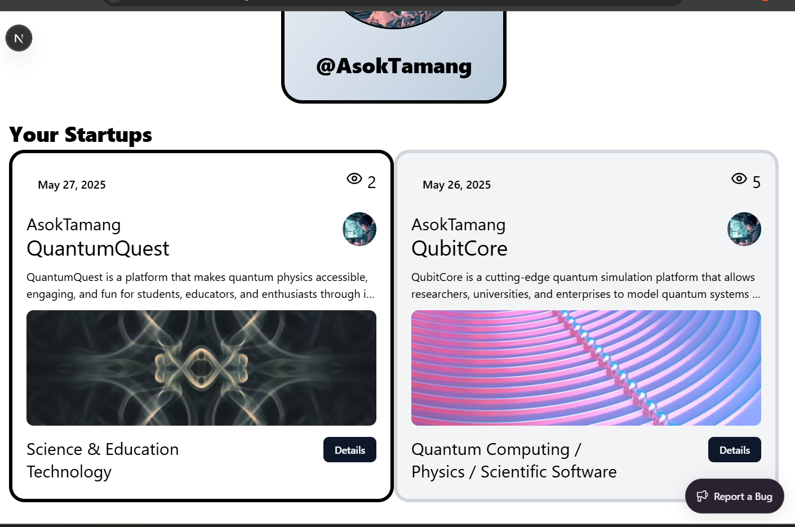

PitchPilot is a modern, cloud-based platform built to help startup founders showcase, manage, and track their startup ideas. It provides a clean interface for submitting pitches, connecting with investors, and showcasing founder profiles.

---

## 🛠️ Tech Stack

- **Frontend:** Next.js 14, Tailwind CSS
- **Backend/Content:** Sanity CMS
- **Authentication:** NextAuth.js (with GitHub provider)
- **Error Monitoring:** Sentry
- **Database:** Sanity (as a headless CMS with GROQ queries)
- **Deployment:** Vercel
- **CI/CD:** GitHub + Vercel auto deploys

---
## 🧪 Features

- User Authentication via GitHub
- Submit and view startup pitches
- Each startup includes: title, pitch, description, image, author, category, and views
- View all startups or filter by author
- Smooth Sanity integration with GROQ queries
- Sentry-powered error monitoring and logging
- Clean UI with Tailwind CSS
- Fully responsive layout

---

## 🔒 Authentication

Implemented using `NextAuth.js`:
- OAuth with GitHub
- Session-based access
- Author data synced to Sanity on login

---

## 📷 Screenshots
Home page ->

  
    
  

Create page -> 

  
    
  

Author page ->  

  
    
  

Startup Detail page -> 

  
    
     
  

